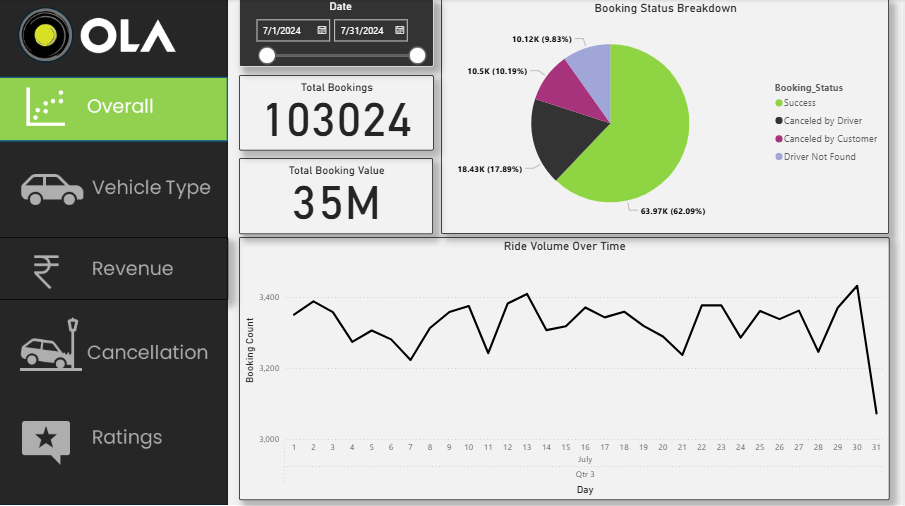
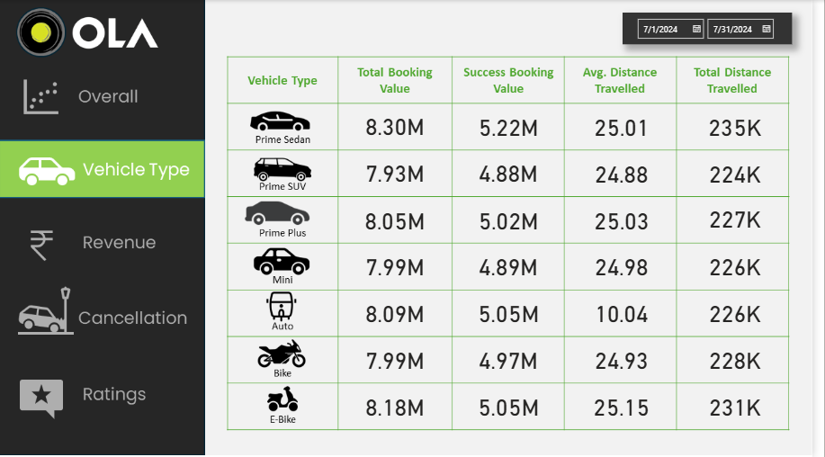
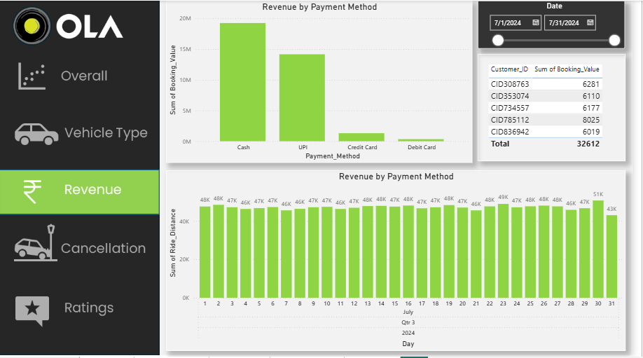
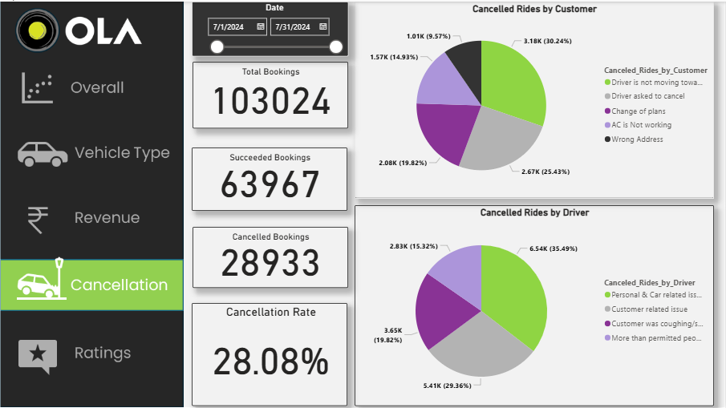
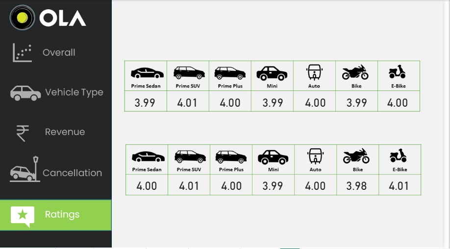

# 📊 Ola Ride-Hailing Data Analysis: A Business Intelligence Case Study

### 🧠 Project Workflow
The analysis followed a structured and repeatable process to ensure accuracy and deliver a high-quality final product:
1.  **Data Ingestion & Cleaning:** The raw dataset, consisting of over 50,000 records of Ola rides, was initially processed using Excel to ensure data integrity and prepare it for analysis.
2.  **Exploratory Data Analysis (EDA) with SQL:** Complex SQL queries were written to explore the data, calculate key metrics, and uncover initial patterns related to ride performance, customer behavior, and revenue.
3.  **Interactive Dashboard Creation:** The cleaned and analyzed data was imported into Power BI. A comprehensive dashboard was designed and built to visualize the key findings and provide an interactive platform for data exploration.

***

### ⚙️ Tools & Technologies
The project leverages a robust stack of tools essential for a modern data analytics workflow:
* **Data Sourcing & Cleaning:** Excel
* **Data Analysis & Querying:** SQL (Queries were written and executed to transform and analyze data).
* **Business Intelligence & Visualization:** Power BI

***

### 📸 Dashboard Snapshots
The core output of this project is an interactive Power BI dashboard that brings the data to life. These visualizations provide a snapshot of the insights generated.







### 📁 Repository Structure
```text
The repository is organized to be intuitive and easy to navigate for reviewers and collaborators.
├── data/
│   ├── Ola_Dataset.xlsx
│   └── (Any other raw data files)
├── sql/
│   └── Ola_SQL_Queries.sql
├── powerbi/
│   ├── Ola Ride Hailing Data Analysis.pbix
│   └── Ola_Dashboard_Report.pdf (optional, if you create one)
├── images/
│   ├── dashboard_main_page.png
│   ├── cancellation_analysis.png
│   ├── vehicle_type_performance.png
│   ├── payments_revenue_breakdown.png
│   ├── driver_customer_ratings.png
├── README.md
└── .gitignore# 📊 Ola Ride-Hailing Data Analysis: A Business Intelligence Case Study

### About Me
Hello! I'm Shashwat Trivedi, an aspiring data analyst passionate about transforming raw data into actionable insights. This project showcases my proficiency in data cleaning, analysis, and visualization using industry-standard tools.

***
